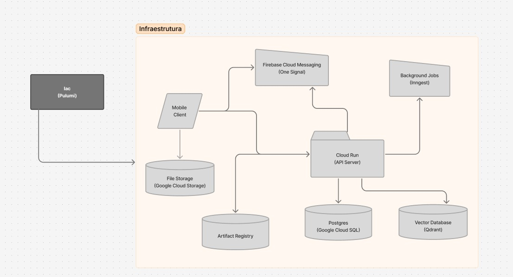

# Infraestrutura — Animus

## Visão Geral

A infraestrutura do Animus é provisionada via **IaC com Pulumi** e hospedada majoritariamente no **Google Cloud Platform (GCP)**. Ela é composta por um cliente mobile, uma API central em Cloud Run, armazenamento de arquivos, banco de dados relacional e vetorial, serviço de notificações push, jobs assíncronos e um repositório de imagens para deploy.



---

## Componentes

### 📱 Mobile Client
O aplicativo Flutter rodando no dispositivo do usuário. É o ponto de entrada das interações com a plataforma e possui três responsabilidades principais:
- Enviar arquivos diretamente para o **Google Cloud Storage**
- Consumir os endpoints da **API Server** via HTTP
- Receber notificações push via **OneSignal / Firebase Cloud Messaging**

---

### ☁️ IaC — Pulumi
Toda a infraestrutura é declarada e provisionada como código usando **Pulumi**. Esse módulo gerencia a criação e evolução dos recursos da arquitetura no GCP, garantindo rastreabilidade, reproducibilidade e automação dos ambientes.

---

### 🖥️ Cloud Run — API Server
Núcleo da aplicação. Serviço serverless que executa o backend FastAPI em container. Responsável por:
- Autenticar usuários e gerenciar sessões
- Orquestrar o fluxo de análise de petições
- Consultar o banco relacional e o banco vetorial
- Disparar jobs assíncronos no Inngest
- Acionar o serviço de notificações push
- Expor todos os endpoints consumidos pelo Mobile Client

---

### 🗂️ File Storage — Google Cloud Storage
Armazena os arquivos enviados pelo usuário, como petições e autos em PDF/DOCX. O Mobile Client faz upload direto para o bucket via **Signed URL** gerada pela API Server, evitando trafegar arquivos pesados pelo backend.

---

### 🗃️ Artifact Registry
Repositório de imagens Docker no GCP. Armazena as imagens geradas pelos pipelines de CI/CD e publicadas para posterior deploy no Cloud Run.

---

### 🐘 Postgres — Google Cloud SQL
Banco de dados relacional gerenciado. Armazena todos os dados estruturados da aplicação: usuários, análises, precedentes selecionados e relatórios gerados.

---

### 🔍 Vector Database — Qdrant
Banco de dados vetorial responsável por armazenar os embeddings dos precedentes judiciais do **Pangea**. Utilizado na etapa de busca semântica (RAG) para recuperar os precedentes mais similares ao texto da petição enviada.

---

### ⚙️ Background Jobs — Inngest
Plataforma de orquestração de jobs assíncronos. Disparado pela API Server para executar tarefas de longa duração fora do ciclo de request/response, como:
- Processamento de análises e etapas longas do fluxo jurídico
- Geração de minutas e relatórios assíncronos
- Execução de rotinas de apoio à pipeline de análise

---

### 🔔 Firebase Cloud Messaging — One Signal
Serviço de notificações push integrado ao app mobile. A API Server publica eventos de notificação e o usuário recebe avisos assíncronos no dispositivo, por exemplo quando uma análise, busca de precedentes ou geração de minuta é concluída.

---

## Fluxo Principal

```
IaC (Pulumi)
  │
  └──► Provisiona os recursos da infraestrutura

Mobile Client
  │
  ├──► Google Cloud Storage (upload direto de arquivos via Signed URL)
  ├──► Cloud Run / API Server (requisições da aplicação)
  └──◄── OneSignal / Firebase Cloud Messaging (recebimento de notificações push)

Cloud Run / API Server
  │
  ├──► Google Cloud SQL / Postgres (persistência transacional)
  ├──► Qdrant (busca vetorial de precedentes)
  ├──► Inngest (execução de jobs assíncronos)
  └──► OneSignal / Firebase Cloud Messaging (envio de notificações)

Artifact Registry
  │
  └──► Armazena as imagens publicadas para deploy do backend
```

---

## Resumo dos Serviços

| Componente | Tecnologia | Responsabilidade |
|---|---|---|
| IaC | Pulumi | Provisionamento da infraestrutura como código |
| Mobile Client | Flutter | Interface do usuário, upload de arquivos e consumo da API |
| API Server | GCP Cloud Run | Backend principal (FastAPI em container) |
| File Storage | Google Cloud Storage | Armazenamento de petições PDF/DOCX |
| Artifact Registry | GCP Artifact Registry | Repositório de imagens Docker |
| Banco Relacional | Google Cloud SQL (Postgres) | Persistência dos dados da aplicação |
| Banco Vetorial | Qdrant | Busca semântica de precedentes (RAG) |
| Jobs Assíncronos | Inngest | Processamento de tarefas longas |
| Notificações | Firebase Cloud Messaging / OneSignal | Push notifications para o mobile |
