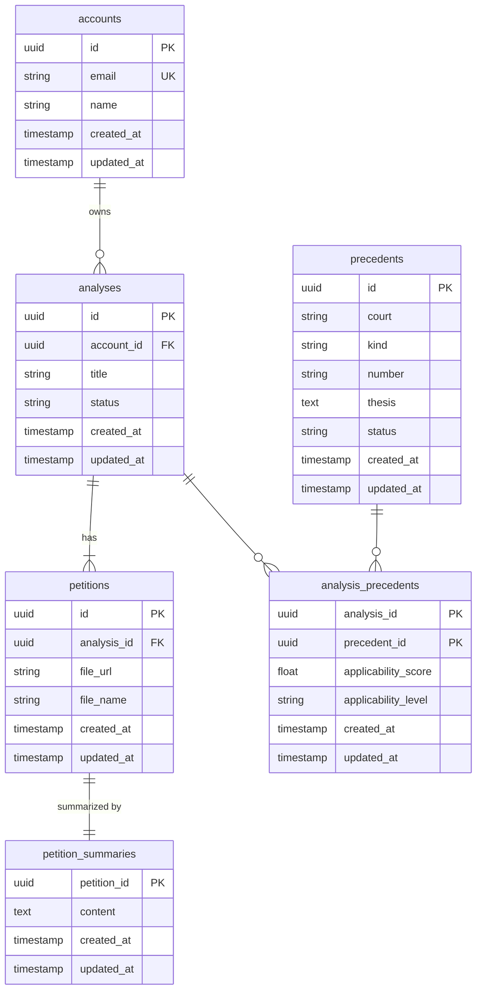

# Modelagem do Banco de Dados

## Diagrama ER

## Descrição das tabelas

### `accounts`
Armazena os dados de conta dos usuários do sistema (juízes e advogados).

| Campo | Tipo | Descrição |
|---|---|---|
| `id` | uuid | Identificador único da conta (PK) |
| `email` | string | E-mail do usuário — único no sistema |
| `name` | string | Nome do usuário |
| `created_at` | timestamp | Data de criação do registro |
| `updated_at` | timestamp | Data da última atualização |

---

### `analyses`
Representa uma sessão de análise iniciada por um usuário. Cada análise agrupa uma petição enviada e os precedentes encontrados para ela.

| Campo | Tipo | Descrição |
|---|---|---|
| `id` | uuid | Identificador único da análise (PK) |
| `account_id` | uuid | Referência à conta do usuário (FK) |
| `title` | string | Nome dado à análise pelo usuário |
| `status` | string | Estado atual da análise (`pending`, `processing`, `done`, `error`) |
| `created_at` | timestamp | Data de criação do registro |
| `updated_at` | timestamp | Data da última atualização |

---

### `petitions`
Armazena os arquivos de petição enviados pelo usuário dentro de uma análise. Suporta PDF e DOCX (até 20MB).

| Campo | Tipo | Descrição |
|---|---|---|
| `id` | uuid | Identificador único da petição (PK) |
| `analysis_id` | uuid | Análise à qual a petição pertence (FK, cascade delete) |
| `file_url` | string | URL do arquivo no Google Cloud Storage |
| `file_name` | string | Nome original do arquivo enviado |
| `created_at` | timestamp | Data de criação do registro |
| `updated_at` | timestamp | Data da última atualização |

---

### `petition_summaries`
Armazena o resumo gerado pela IA para uma petição. Possui relação 1:1 com `petitions` — a chave primária é também a chave estrangeira.

| Campo | Tipo | Descrição |
|---|---|---|
| `petition_id` | uuid | PK e FK para `petitions` (cascade delete) |
| `content` | text | Texto do resumo gerado pela IA |
| `created_at` | timestamp | Data de criação do registro |
| `updated_at` | timestamp | Data da última atualização |

---

### `precedents`
Catálogo de precedentes judiciais indexados a partir da base do Pangea. Um precedente é identificado de forma única pela combinação `(court, kind, number)`.

| Campo | Tipo | Descrição |
|---|---|---|
| `id` | uuid | Identificador único do precedente (PK) |
| `court` | string | Tribunal de origem |
| `kind` | string | Tipo/espécie do precedente |
| `number` | string | Número identificador no tribunal |
| `thesis` | text | Tese firmada no precedente |
| `status` | string | Status atual do precedente |
| `created_at` | timestamp | Data de criação do registro |
| `updated_at` | timestamp | Data da última atualização |

> `court + kind + number` formam uma `UniqueConstraint` — garante que o mesmo precedente não seja indexado duas vezes.

---

### `analysis_precedents`
Tabela de associação N:N entre `analyses` e `precedents`. Além de materializar o relacionamento, persiste o score e nível de aplicabilidade calculados pela IA para cada par análise-precedente.

| Campo | Tipo | Descrição |
|---|---|---|
| `analysis_id` | uuid | PK composta + FK para `analyses` (cascade delete) |
| `precedent_id` | uuid | PK composta + FK para `precedents` (cascade delete) |
| `applicability_score` | float | Score numérico de aplicabilidade (0.0 a 1.0) |
| `applicability_level` | string | Nível semântico: `applicable`, `possibly_applicable`, `not_applicable` |
| `created_at` | timestamp | Data de criação do registro |
| `updated_at` | timestamp | Data da última atualização |

---

## Relacionamentos

| Relação | Cardinalidade | Detalhe |
|---|---|---|
| `accounts` → `analyses` | 1:N | Um usuário pode ter várias análises |
| `analyses` → `petitions` | 1:N | Uma análise pode conter mais de uma petição |
| `petitions` → `petition_summaries` | 1:1 | Cada petição tem no máximo um resumo gerado |
| `analyses` ↔ `precedents` | N:N | Mediado por `analysis_precedents` |