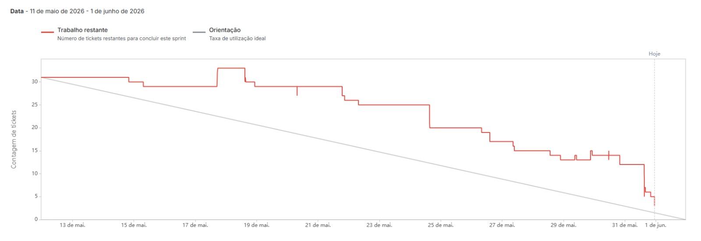

# Sprint - 3️⃣

> **Período:** 28/04/2026 – 25/05/2026

---

## Requisitos realizados nessa sprint ✨

### Fluxo de Análise Inicial para o perfil Advogado (RF 07):
- Atualização do domínio e schema do banco de dados do módulo `intake` para suportar múltiplos tipos de análise (`analysis_type`) e novas entidades (`petition_draft`, `sentence_draft`)
- Job assíncrono de geração de minuta de petição inicial via pipeline de IA, com estrutura obrigatória (fatos, fundamentos, tese, pedidos e citações de precedentes)
- Endpoint para consultar minuta de petição da análise e endpoint de busca de rascunho de petição
- Endpoint de relatório da análise do advogado com seções específicas para o perfil
- Endpoints de regeração de minuta de petição e minuta de sentença com comentários textuais do usuário
- Tela de análise do advogado no mobile com visualização de precedentes ranqueados, justificativa de aderência e acionamento de geração de minuta
- Dialog de regeração de minuta com campo de comentários do usuário para orientar a revisão pela IA
- Geração de PDF do relatório da análise do advogado com minuta completa e precedentes associados

### Análise para 2ª Instância para o perfil Juiz (RF 08):
- Job de extração automática de petição inicial dos autos completos em PDF
- Job assíncrono de geração de minuta de sentença estruturada (relatório, fundamentação, análise de aderência/distinção e dispositivo sugerido)
- Endpoint de busca de rascunho de sentença
- Tela de análise de segunda instância no mobile com fluxo completo: upload de autos, extração, precedentes e minuta
- Geração de PDF de relatório da análise do juiz de 2ª instância com minuta de sentença e precedentes

### Armazenamento e Organização de Análises (evolução):
- Endpoint para desarquivar análise (operação reversa do arquivamento introduzido na Sprint 2)
- Tela de análises arquivadas no mobile com listagem e opção de restauração

### Gerenciamento de Sessão do Usuário (evolução):
- Endpoint para renovação de sessão (`POST /auth/refresh`) com rotação de tokens
- Interceptor Dio com refresh automático de sessão no mobile, eliminando expiração silenciosa durante uso ativo

### Experiência do Usuário e Interface:
- Dialog de criação de análise por tipo (seleção entre "Análise Inicial" e "Análise para 2ª Instância")
- Adaptação do card de análise na Home para exibir tipo de análise (Inicial / 2ª Instância)
- Refatoração do `AnalysisPrecedentsBubble` para permitir visualizar, escolher e desescolher precedentes em todas as telas de análise
- Endpoint para adicionar precedente manualmente a uma análise por identificador
- Atualização do domínio mobile do módulo `intake` com novos DTOs e contratos para os fluxos do advogado e juiz
- Dark/light mode no app mobile

### Notificações (evolução):
- Notificações push de conclusão de minuta de sentença e minuta de petição com `analysis_type` no payload, permitindo navegação contextual no app

### Infraestrutura e DevOps:
- Pipeline de CD de produção para IaC, server e mobile

### Documentação:
- Manual do usuário
- Manual do produto

---

## User Stories realizadas nessa sprint 📖

| # | Chave | User Story | Status |
|---|-------|------------|--------|
| US09 | ANI-87 | Como Advogado, quero receber os **precedentes aplicáveis à minha petição ranqueados por relevância**, para escolher com mais segurança jurídica quais utilizarei como base para o meu caso | ✅ Concluído |
| US10 | ANI-88 | Como Advogado, quero entender o **motivo pelo qual cada precedente foi selecionado** para o meu caso, para avaliar se ele realmente se aplica à situação do meu cliente antes de utilizá-lo | ✅ Concluído |
| US11 | ANI-89 | Como Advogado, quero receber uma **sugestão de estrutura de petição inicial** gerada com base nos precedentes selecionados, para reduzir o tempo de elaboração e aumentar a consistência jurídica do meu documento | ✅ Concluído |
| US12 | ANI-90 | Como Juiz, quero que o sistema **extraia automaticamente a petição inicial de dentro dos autos** enviados, para que eu não precise identificar ou separar a peça manualmente antes de iniciar a análise | ✅ Concluído |
| US13 | ANI-91 | Como Juiz, quero receber uma **minuta de sentença gerada com base nos precedentes aplicáveis** ao caso extraído dos autos, para acelerar minha análise e padronizar a fundamentação jurídica da decisão | ✅ Concluído |

---

## Critérios de aceitação para cada User Story 📒

### US09 — Precedentes ranqueados por relevância para o Advogado

- **Dado** que o Advogado enviou uma petição inicial válida e a análise foi concluída, **quando** ele visualizar a lista de precedentes, **então** cada card deve exibir o percentual de aplicabilidade, o nível de classificação (Aplicável / Possivelmente aplicável / Não aplicável) e os precedentes devem estar ordenados por critérios jurídicos combinados (similaridade semântica, aderência fática, atualidade e hierarquia do tribunal).
- **Dado** que o Advogado toca em um precedente, **quando** a visualização dedicada for aberta, **então** deve ser exibido um trecho destacado do precedente relacionado ao caso, além dos campos padrão (tribunal, tipo, número, questão e tese).
- **Dado** que um precedente possui status de risco (Afetado ou Controvérsia vinculada), **quando** o card for renderizado, **então** deve exibir aviso visual distinto e não invasivo. Precedentes com status Cancelado, Não admitido ou Controvérsia cancelada nunca são exibidos.

### US10 — Justificativa de aderência por precedente

- **Dado** que a análise do Advogado foi concluída, **quando** ele acessar o detalhe de um precedente, **então** deve ser exibida uma justificativa gerada pela IA relacionando explicitamente elementos da petição com o conteúdo do precedente.
- **Dado** que o precedente foi classificado como "Não aplicável", **quando** a justificativa for exibida, **então** ela deve indicar ao menos um ponto de distinção que explique a baixa aplicabilidade.
- **Dado** que o Advogado exportou o PDF do relatório, **quando** o documento for gerado, **então** a justificativa do precedente escolhido deve constar no relatório. As demais justificativas são exibidas apenas na tela.
- **Dado** que a justificativa foi gerada pela IA, **quando** o Advogado visualizar o texto, **então** o conteúdo não deve ser editável.

### US11 — Geração de sugestão de estrutura de petição inicial

- **Dado** que o Advogado confirmou os precedentes desejados, **quando** ele acionar a geração, **então** o sistema deve gerar uma minuta contendo: fatos estruturados, fundamentos jurídicos, tese central, pedidos e citações dos precedentes com trechos destacados identificando tribunal, tipo e número.
- **Dado** que a minuta foi gerada, **quando** o Advogado não estiver satisfeito, **então** ele pode solicitar a regeração informando comentários textuais obrigatórios para orientar a revisão. A nova versão substitui a anterior.
- **Dado** que a geração ultrapassa 60 segundos sem resposta, **quando** o timeout for atingido, **então** o sistema deve cancelar a operação, notificar o Advogado e oferecer opção de tentar novamente.
- **Dado** que a minuta foi gerada com sucesso, **quando** o Advogado acionar a exportação, **então** o PDF deve conter a minuta completa junto ao nome da análise e os precedentes utilizados, entregue via share sheet nativo do dispositivo.

### US12 — Extração automática da petição inicial dos autos

- **Dado** que o Juiz selecionou "Análise para 2ª Instância" e enviou o PDF dos autos, **quando** o processamento for concluído, **então** o sistema deve localizar e apresentar a peça que abre o processo (com fatos, fundamento jurídico e pedido) para confirmação antes de prosseguir.
- **Dado** que a extração automática identificou a petição com confiança suficiente, **quando** a tela de confirmação for exibida, **então** o Juiz deve poder confirmar ou corrigir manualmente a peça extraída sem necessidade de reenviar o arquivo.
- **Dado** que o sistema não conseguiu identificar a petição com confiança, **quando** o fluxo atingir a etapa de confirmação, **então** deve solicitar que o Juiz indique manualmente a peça sem apresentar candidata automática.
- **Dado** que o processamento ultrapassa 60 segundos, **quando** o timeout for atingido, **então** o sistema deve cancelar, notificar o Juiz e oferecer opção de retentar.

### US13 — Geração de minuta de sentença com base nos precedentes

- **Dado** que a petição foi extraída e confirmada e os precedentes foram retornados, **quando** o Juiz acionar a geração, **então** a minuta de sentença deve conter obrigatoriamente: relatório (resumo do caso), fundamentação (baseada nos precedentes), análise de aderência ou distinção para cada precedente utilizado e dispositivo sugerido.
- **Dado** que nenhum precedente foi classificado como "Aplicável" (faixa 85–95%), **quando** a minuta for exibida, **então** um aviso visual destacado deve sinalizar a ausência de precedentes com forte aderência, sem bloquear a geração nem a exportação.
- **Dado** que o Juiz não está satisfeito com a minuta, **quando** ele acionar a regeração com comentários textuais, **então** a nova versão deve substituir a anterior, preservando o conteúdo não mencionado nos comentários, sem exigir reenvio dos autos.
- **Dado** que a minuta foi gerada com sucesso, **quando** o Juiz acionar a exportação, **então** o PDF deve conter: cabeçalho com nome da análise e data, minuta completa, precedentes associados com detalhes e justificativas, e aviso de ausência de precedentes fortes quando aplicável.

---

## Tasks realizadas nessa sprint 🛠️

### `[server]`

| Chave | Task | Responsável | Status |
|-------|------|-------------|--------|
| ANI-92 | Atualização do domínio e schema do banco de dados do módulo intake | João P. | ✅ Concluído |
| ANI-93 | Job de geração de minuta de petição inicial | João P. | ✅ Concluído |
| ANI-94 | Job de geração de minuta de sentença do juiz de segunda instância | João P. | ✅ Concluído |
| ANI-95 | Endpoint para desarquivar análise | Gustavo | ✅ Concluído |
| ANI-98 | Endpoint de busca de rascunho de petição | Gustavo | ✅ Concluído |
| ANI-99 | Endpoint de relatório da análise do advogado | Kauan | ✅ Concluído |
| ANI-100 | Endpoint para consultar minuta de petição da análise | Gustavo | ✅ Concluído |
| ANI-114 | Endpoint de busca de rascunho de sentença | Gustavo | ✅ Concluído |
| ANI-116 | Job de extração de petição dos autos | João P. | ✅ Concluído |
| ANI-119 | Endpoint para adicionar precedente manualmente a uma análise por identificador | Kauan | ✅ Concluído |
| ANI-120 | Notificações push de conclusão de minuta de sentença e minuta de petição com `analysis_type` no payload | Gustavo | ✅ Concluído |
| ANI-124 | Endpoint para renovação de sessão | João P. | ✅ Concluído |
| ANI-126 | Endpoints de regeração de minuta de petição e minuta de sentença com comentários do usuário | João P. | ✅ Concluído |

### `[mobile]`

| Chave | Task | Responsável | Status |
|-------|------|-------------|--------|
| ANI-101 | Dialog de criação de análise por tipo | Thigz | ✅ Concluído |
| ANI-102 | Adaptação do card de análise na home por tipo de análise | Thigz | ✅ Concluído |
| ANI-103 | Tela de análise do advogado | Thigz | ✅ Concluído |
| ANI-104 | Tela de análise de segunda instância | João P. | ✅ Concluído |
| ANI-105 | Geração de PDF do relatório da análise do advogado | João P. | ✅ Concluído |
| ANI-106 | Geração de PDF de relatório da análise do juiz | João P. | ✅ Concluído |
| ANI-107 | Tela de análises arquivadas | Thigz | ✅ Concluído |
| ANI-108 | Dark/light mode | Thigz | ✅ Concluído |
| ANI-115 | Atualização do domínio do módulo intake | João P. | ✅ Concluído |
| ANI-117 | Permitir visualizar, escolher e desescolher precedentes no AnalysisPrecedentsBubble em todas as telas de análise | João P. | ✅ Concluído |
| ANI-125 | Interceptor Dio com refresh automático de sessão | João P. | ✅ Concluído |
| ANI-127 | Dialog de regeração de minuta com comentários do usuário | João P. | ✅ Concluído |

### `[iac / devops]`

| Chave | Task | Responsável | Status |
|-------|------|-------------|--------|
| ANI-109 | CD de produção (IaC) | Gabriel | ✅ Concluído |
| ANI-110 | CD de produção (server) | Gabriel | ✅ Concluído |
| ANI-111 | CD de produção (mobile) | Gabriel | ✅ Concluído |

### `[documentação]`

| Chave | Task | Responsável | Status |
|-------|------|-------------|--------|
| ANI-96 | Manual do usuário | João Gabriel | ✅ Concluído |
| ANI-97 | Manual do produto | João Gabriel | ✅ Concluído |

### `[bugs]`

| Chave | Task | Responsável | Status |
|-------|------|-------------|--------|
| ANI-118 | Filtros de tribunal e tipo de precedente aceitam combinações juridicamente inválidas | Kauan | ✅ Concluído |

---

## Métricas da Sprint 📈

| Métrica | Valor |
|---------|-------|
| Total de tickets na sprint | 36 |
| Tickets concluídos | **36** |
| Tickets em andamento | 0 |
| Tasks técnicas concluídas | 30 |
| User Stories concluídas | 5 (ANI-87, ANI-88, ANI-89, ANI-90, ANI-91) |
| Bugs corrigidos | 1 |

### Distribuição por área

| Área | Concluídos | Em andamento |
|------|------------|--------------|
| `server` | 13 | 0 |
| `mobile` | 12 | 0 |
| `iac / devops` | 3 | 0 |
| `documentação` | 2 | 0 |
| `bugs` | 1 | 0 |
| `histórias (US)` | 5 | 0 |

## Gráfico Burndown 📈

---

## Destaques técnicos da sprint 🌟

- **Dois novos fluxos de análise completos**: a Sprint 3 entregou de ponta a ponta o fluxo de Análise Inicial para Advogado (RF 07) e o fluxo de Análise para 2ª Instância para Juiz (RF 08), cada um com pipeline de IA dedicada, jobs assíncronos, telas específicas e exportação de PDF — dobrando a proposta de valor do produto em uma única sprint.
- **Pipeline de geração de minutas**: novos jobs assíncronos (`petition_draft` e `sentence_draft`) orquestram a geração de minutas estruturadas via IA, com seções obrigatórias definidas por perfil (petição para Advogado, sentença para Juiz), timeout de 60s e regeneração orientada por comentários do usuário.
- **Extração de petição dos autos**: job dedicado processa PDFs de autos completos, localiza a petição inicial automaticamente e apresenta a peça para confirmação pelo Juiz antes de prosseguir — viabilizando o fluxo de 2ª instância sem intervenção manual na separação de peças processuais.
- **Refresh automático de sessão**: o endpoint `POST /auth/refresh` com rotação de tokens, combinado com o interceptor Dio no mobile, eliminou a expiração silenciosa da sessão durante uso ativo, completando o ciclo de gerenciamento de sessão iniciado nas sprints anteriores.
- **Regeração de minutas com comentários**: os endpoints de regeração aceitam instruções textuais do usuário e geram novas versões preservando o conteúdo não mencionado nos comentários, permitindo refinamento iterativo das minutas sem reenvio de documentos nem reseleção de precedentes.
- **Dark/light mode**: o app mobile passou a suportar alternância entre temas claro e escuro, ampliando a acessibilidade e a adaptação visual ao contexto de uso.
- **CD de produção end-to-end**: pipelines de continuous deployment configuradas para IaC, server e mobile, consolidando a infraestrutura necessária para releases contínuos em ambiente de produção.
